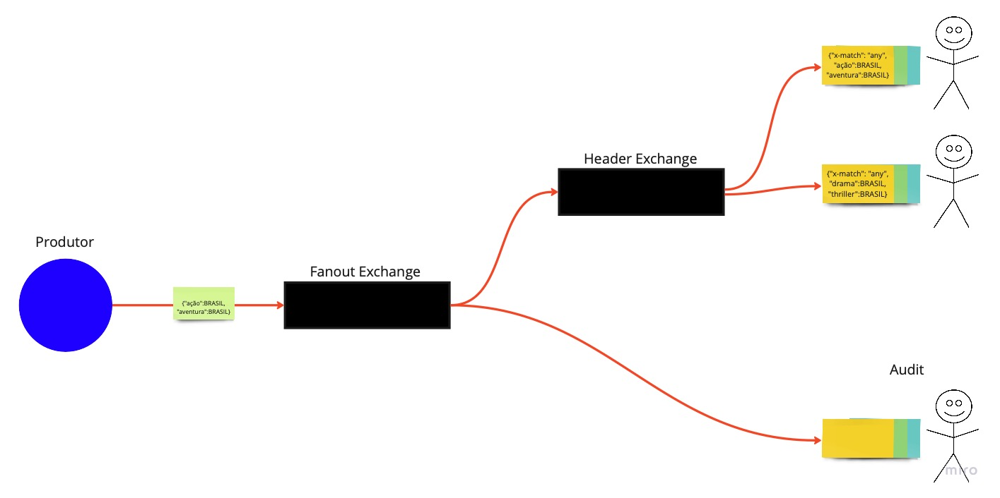

# Flixorama

* Flixorama is a producer-consumer application that simulates the notification of a streaming service based on your country and favorite content genres.
* It utilizes the Fanout and Headers Exchange. The Fanout sends the message to the audit consumer and to the Headers Exchange, than the headers exhcange sends the message to the clients.

## Diagram


## Requirements
* Docker
* Java 18 or later

## Running the Application
First, start Docker:
```
docker-compose up
```
Then, run the application.
> Remember to enable multiple instance running in your code editor.
